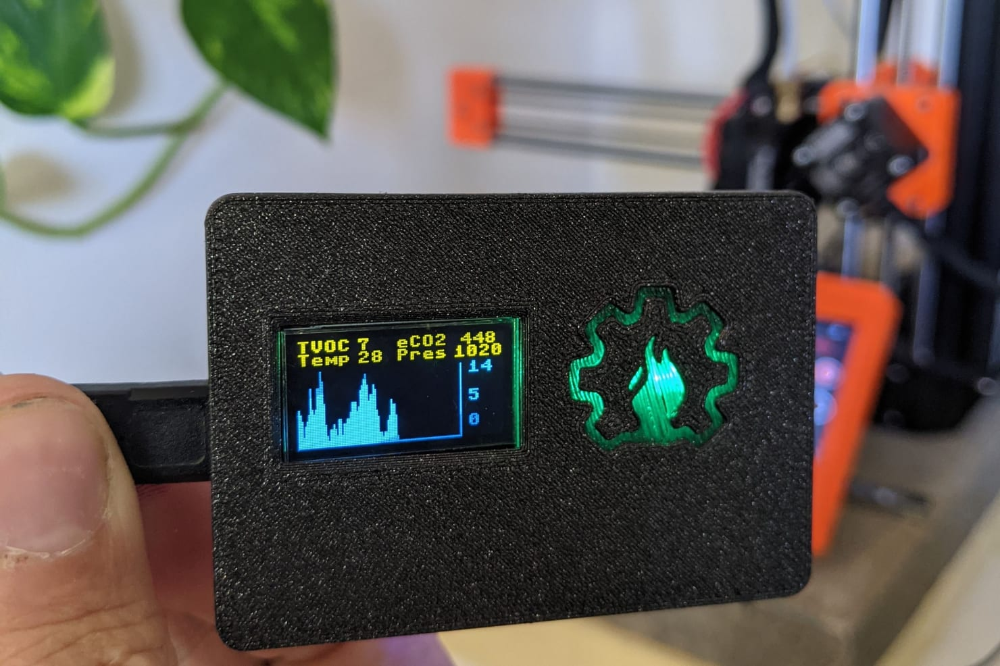
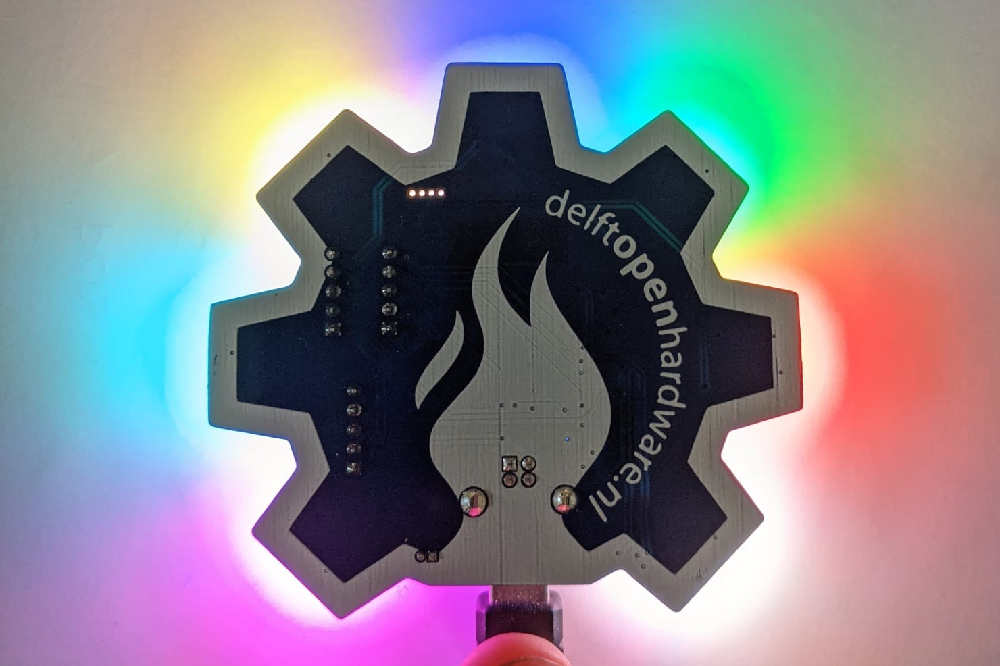
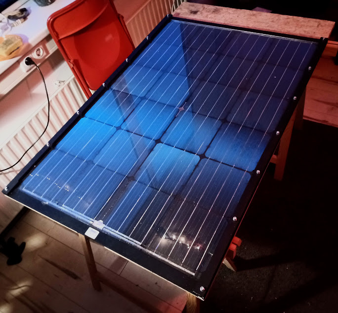

# Current running projects

## Fume sensor

Project lead: Jerry  
Field: Environment  
Status: Ongoing  
Link: [Git repositories](https://gitlab.com/go-commons/delftopenhardware/Air-Quality-sensor-for-workspaces)

## Badge

Project lead: Suryansh  
Field: Cool  
Status: Ongoing  
Link: [Git repositories](https://gitlab.com/go-commons/delftopenhardware/doh-badge)

## Circulair Solar

Project lead: Siemen  
Field: Energy  
Status: Just started  
Link: [Git repositories](https://gitlab.com/go-commons/delftopenhardware/circular-pv-panel)

## Centrifuge

Project lead: Jannes  
Field: Medical  
Status: Ongoing  
Link: [Git repositories](https://gitlab.com/go-commons/delftopenhardware/Open-source-Centrifuge-for-WetLab) 
