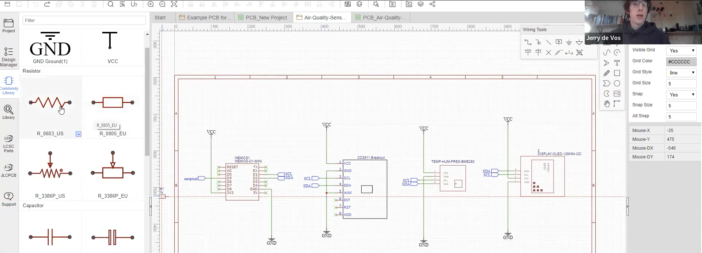

# Events

## 2022 May 20 - Seminar:

## 2022 April 22 - Workshop: 3D modelling and printing

## 2022 March 25 - Seminar: Open! Next?

## 2022 Feb 18 - Workshop: Making your own PCB ⚡

[read more..](92pcbworkshop.md)
---

## 2022 Jan 21 - Seminar: Opening up a flow battery by Sanli Faez🔋

[read more..](93openbattery.md)
---

## 2021 Nov 19 - Pi Cluster Workshop Part II 🍰

[read more..](94clusterworkshop2.md)
---

## 2021 Oct 01 - Pi Cluster Workshop 🥧

[read more..](95clusterworkshop1.md)
---

## 2021 Feb 11 - Hardware sessions @ OSF2021NL👨‍💻

[read more..](96opensciencefestival.md)
---

## 2020 Feb 21 - Third Meetup 👋

[read more..](97thirdmeetup.md)
---

## 2019 Nov 29 - Second Meetup 😎

[read more..](98second%20meetup.md)
---

## 2019 Oct 11 - First Meetup!🚀

[read more..](99first%20meetup.md)
