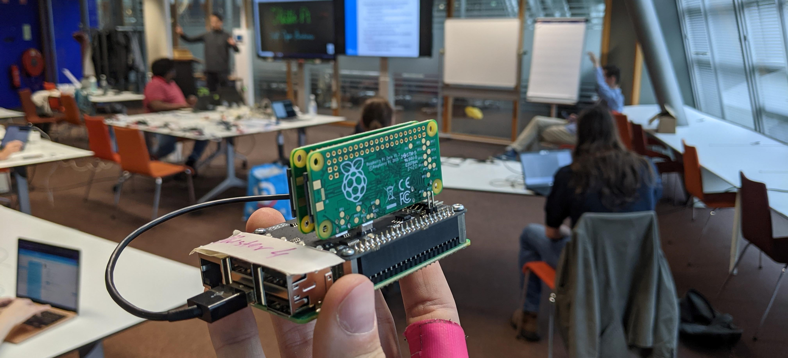
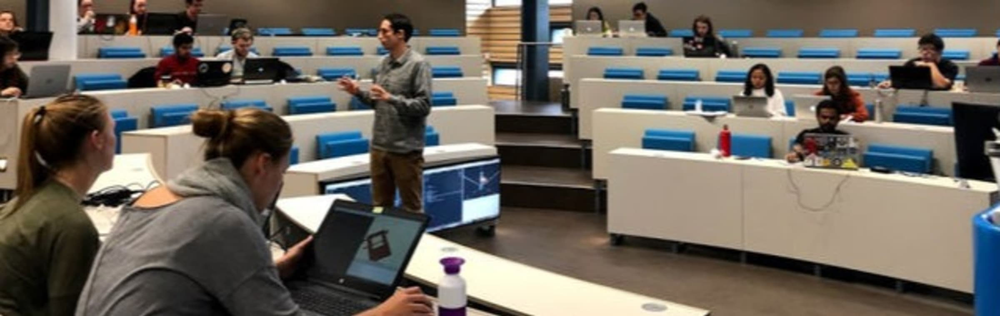

# Updates
  
  
  
# 2021 Nov 19 - Pi Cluster Workshop Part II 🍰

  
Due to new covid restrictions we had to move our second part of the workshop online, but this did not keep us from sharing new information and having others learn more about cloud computing!
Workshop notes can be found here: [https://hackmd.io/lPtoZMKjSJ-oGiGCzObtLQ](https://hackmd.io/lPtoZMKjSJ-oGiGCzObtLQ)

you can watch the presentation and read the slides here:  
<iframe src="https://drive.google.com/file/d/1J1jD1f9bKEE1np9EM5_fpKw7pmbMiq7B/preview" width="480" height="299" allow="autoplay"></iframe>
<iframe src="https://docs.google.com/presentation/d/e/2PACX-1vQVNrRbnbgqemFnf8isZ1WB-dKrtckPturPM7dP14W2EoUXU-4K0lGC7EXesd7sICta5l4WnD-v4m8w/embed?start=false&loop=false&delayms=3000" frameborder="0" width="480" height="299" allowfullscreen="true" mozallowfullscreen="true" webkitallowfullscreen="true"></iframe>
<iframe src="https://docs.google.com/presentation/d/e/2PACX-1vSZkY0UMYyZy83ZOdG-38v2tnCHQGyu6VCV5FiY4ilA105rWJ_kiWK8MmZELbmxMVENA9iT1ZBzb04g/embed?start=false&loop=false&delayms=3000" frameborder="0" width="480" height="389" allowfullscreen="true" mozallowfullscreen="true" webkitallowfullscreen="true"></iframe>
  
---
# 2021 Oct 01 - Pi Cluster Workshop 🥧

  
In Collaboration with the high performance computing center at the TU Delft we organized a workshop on the topic of cluster computing. Together with their expert (Dennis Palagin) we made it possible to visualize a cluster computer with a raspberry pi and multiple raspberry pi zero's.

You can find the workshop notes here: [https://hackmd.io/Vemik7JuS_Cep_fd1WwiHA](https://hackmd.io/Vemik7JuS_Cep_fd1WwiHA)  

<iframe src="https://docs.google.com/presentation/d/e/2PACX-1vTmqcA1OioT1xp3vIcU-v5v12IIb4GKtRR18oODUuePptwNJ6TzelYJzYc1dwKwchUb44fuqecBz6rp/embed?start=false&loop=false&delayms=3000" frameborder="0" width="480" height="389" allowfullscreen="true" mozallowfullscreen="true" webkitallowfullscreen="true"></iframe>
  
---
# 2021 Feb 11 - Hardware sessions @ OSF2021NL👨‍💻

  
We gave a workshop at the Open Sience Festival 2021!  
For this event we made a custom Delft Open Hardware Badge!  
Check out the project **[here](https://wikifactory.com/+delftopenhardware/doh-badge)**!  
Badge designed by Suryansh, workshop by Nic  

<iframe src="https://docs.google.com/presentation/d/e/2PACX-1vQ9-HNboWJBokZXX0cRvA_q6cLdt_H4NXK-o2Gh1MJm_fh718OLbVYBZ_lvu4Ho6H1eNR2G47ooRNs1/embed?start=false&loop=false&delayms=3000" frameborder="0" width="480" height="299" allowfullscreen="true" mozallowfullscreen="true" webkitallowfullscreen="true"></iframe>

<iframe src="https://docs.google.com/presentation/d/e/2PACX-1vSkqW8t_5AP55cNZg7vmtVEW9sod3VIbSA0JUn0gg9dY2xEQS_85eFmkvdHhiBo0DE2CNyCbSbEFpG5/embed?start=false&loop=false&delayms=3000" frameborder="0" width="480" height="299" allowfullscreen="true" mozallowfullscreen="true" webkitallowfullscreen="true"></iframe>
  
---
# 2020 Feb 21 - Third Meetup 👋

At the beginning of the year we had a combined meetup, we had a lovely guest speaker and two workshops!  
slides can be found **[here](https://docs.google.com/presentation/d/1zicYHzbC2SC2LGibHem4bBZk9jS7-EnMmKbKgoyVnjs/edit?usp=sharing)**  
presentation by Raymond  Schouten   
workshop Arduino  
workshop Micropython by Chuck and Jose  
<iframe src="https://docs.google.com/presentation/d/e/2PACX-1vTUIAEO5zfCheCt6aoe9W_ry2RZz8fF0e2_-e-QM92qlHjS54xIjgKXR2tEH5a-2pWUWNAIeMX3L76I/embed?start=false&loop=false&delayms=3000" frameborder="0" width="480" height="299" allowfullscreen="true" mozallowfullscreen="true" webkitallowfullscreen="true"></iframe>
  
---
# 2019 Nov 29 - Second Meetup 😎

After our kickoff event where we shared our vision, we wanted to have a more interactive session, this time we gave a workshop on Git!

<iframe src="https://docs.google.com/presentation/d/e/2PACX-1vQtUC2CM04Zzun3qI9P04nEuj9Lf0X795a-YoVfaN2aM0PqFIy4Av6cntBBpovSrk-iC_rb4zzdI7jI/embed?start=false&loop=false&delayms=3000" frameborder="0" width="480" height="299" allowfullscreen="true" mozallowfullscreen="true" webkitallowfullscreen="true"></iframe>
  
---
# 2019 Oct 11 - First Meetup!🚀

  
Back in october 2019 we had our initial launch of the Delft Open Hardware Community!  
Here we outlined our vision and had two guest speakers:  
Jerry de Vos : How to fight plastic pollution  
**[https://preciousplastic.com/](https://preciousplastic.com/)**  
Krishna: An open source interface for blind users to learn coding  
**[https://github.com/curiostudio/project_curio](https://github.com/curiostudio/project_curio)**  

[Kickoff Meetup 11_10_2019_Meetup0.1](https://docs.google.com/presentation/d/1XUEywon6MfoAYjIebGuYnrfpwANvo1tGo_vHPBTMPPs/edit?usp=drivesdk)
